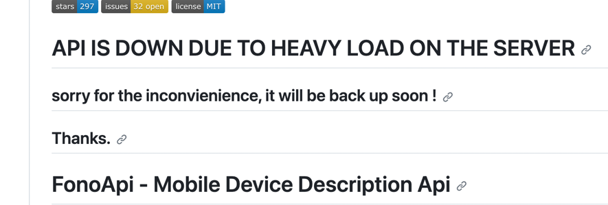

## How to run locally
1. Run [Docker Desktop](https://www.docker.com/products/docker-desktop/)
2. Create SpringBoot run configuration for the `com.asp.phonebooking.PhoneBookingApplication` class
3. Set `Active profiles: local`
4. Run

PostgreSQL database will be created automatically in Docker. Admin and user, and some test data will be created automatically as well.

## How to test locally
1. Open [Swagger UI](http://localhost:8080/swagger-ui/index.html)
2. Use the following credentials to login as ADMIN:
   - User: `admin`
   - Password: `admin`
3. or use the following credentials to login as USER:
   - User: `user`
   - Password: `user123`
4. Create phone models (some phone models already exist for testing purposes)
5. Create phones. A phone model should be assigned to each phone (some phones already exist for testing purposes)
6. Book a phone (some bookings already exist for testing purposes)

### IMPORTANT
[FonoApi](https://github.com/shakee93/fonoapi) integration hasn't been implemented because FonoApi is down, and it is impossible to check how it works.


## How to build jar file and docker image
```
./mvnw clean install -DskipTests
docker build -t asp/phonebooking .
```